# bedrockbarag
bedrockbarag : Enterprise Knowledge Assistant # Bedrock # KB # RAG # text-to-vector

## Objective
To create an Amazon Bedrock Knowledge Based using text-to-text & text-to-vector model for Retrieval Augmented Generation (RAG) in Enterprise Knowledge Assistant.

## Bedrock Enterprise Knowledge Assistant (RAG)

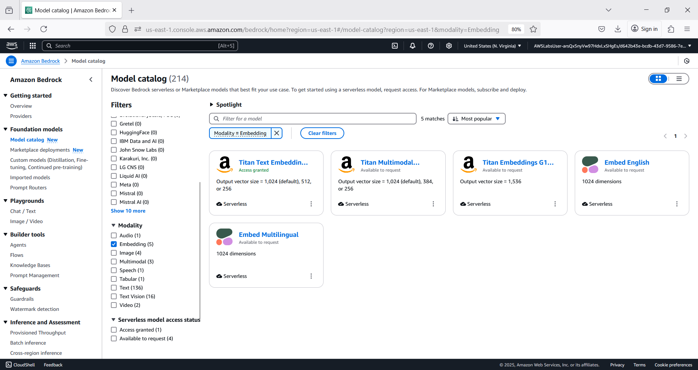

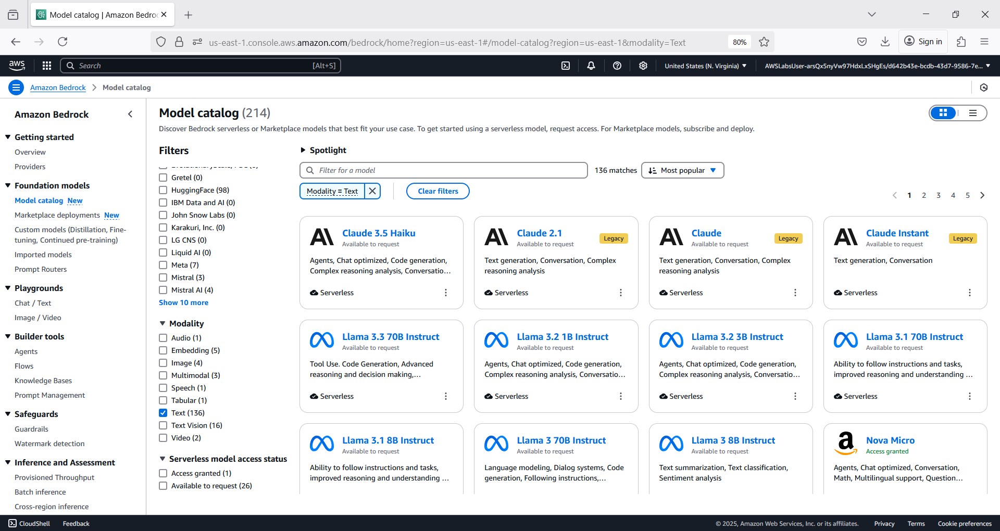

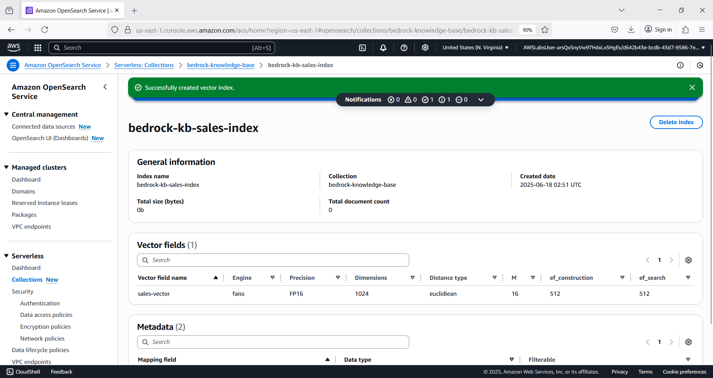

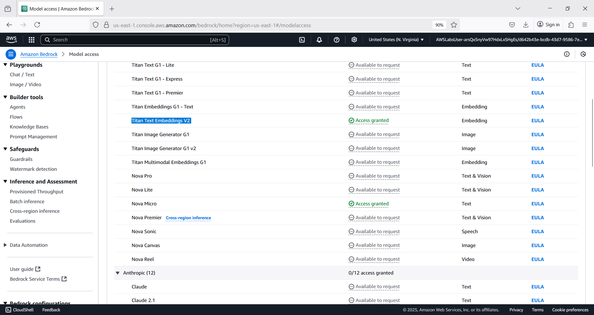

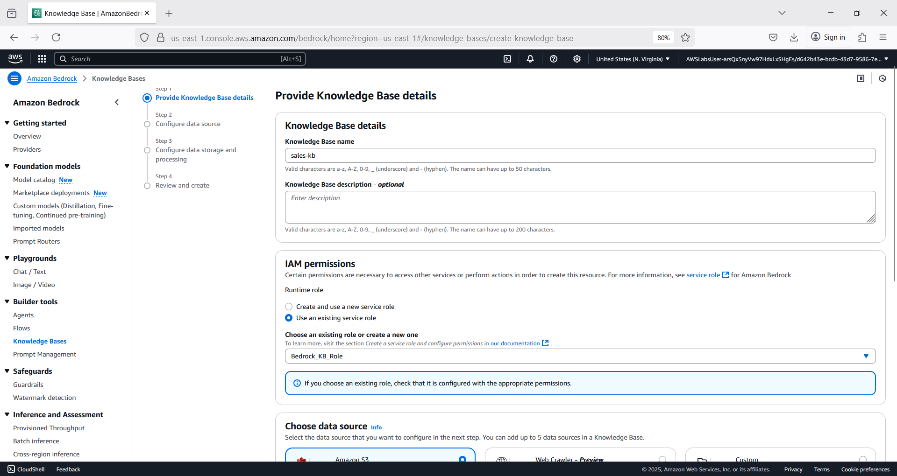

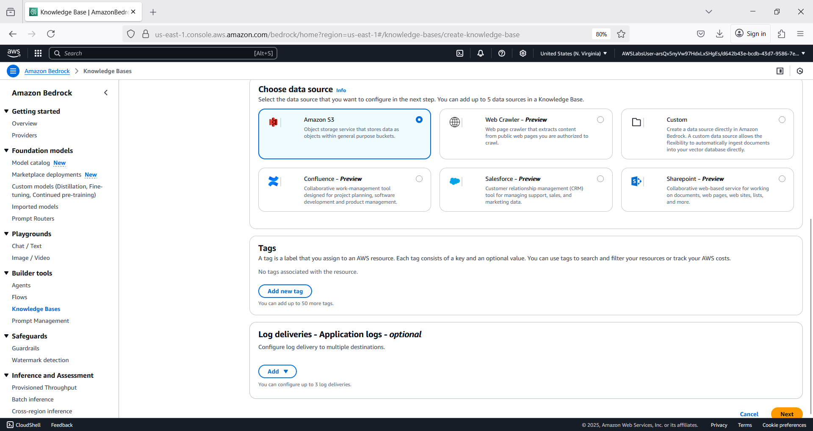

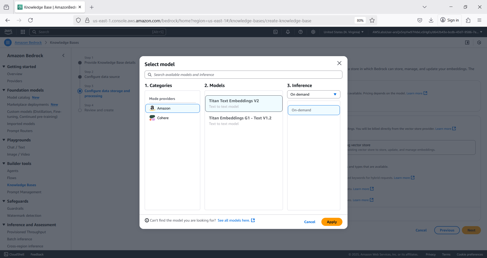

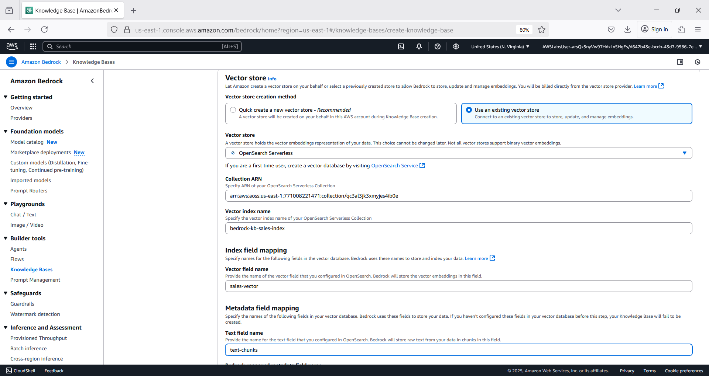

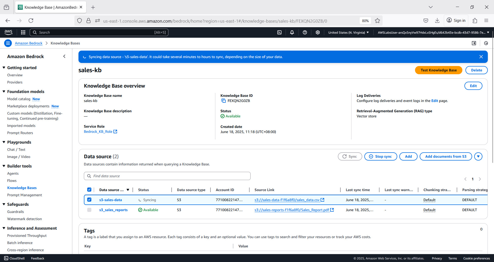

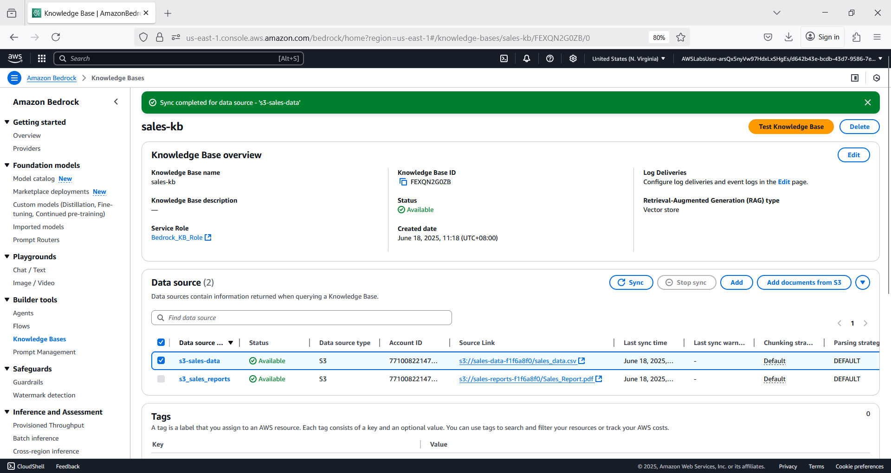

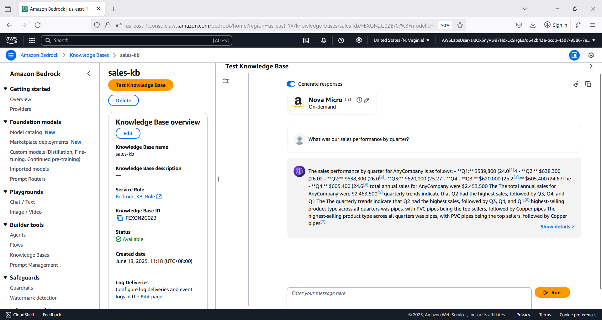

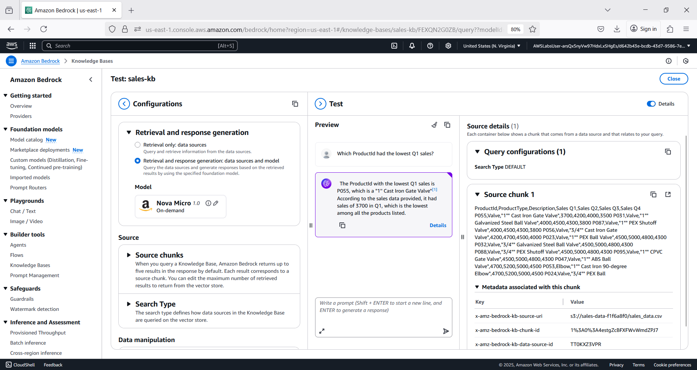
